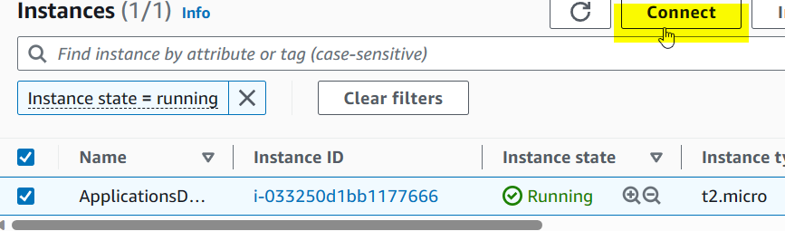

# PythonApp

# How to deploy a simple Python application in AWS EC2 server.

### To package and host a simple Python application,we would need to follow these simple steps

##### 1. Spin up an ec2 instance server with tag name : ApplicationsDeploy as shown below. Select an existing key pair and Launch an instance

Instance launched successfully

##### 2. Click on connect button to get the SSH key and connect using the termius terminal

##### 3. Put an hostname on the ubuntu server (ApplicationDeploy) and install an update and upgrade as shown below

##### 4.Proceed to install Python ,check its version and install the npm dependencies

##### 5. Install the Flask

##### 6.  Create a file using the vim editor and paste the Python code inside it making a slight modification to reflect "Python Application successfully deployed".Please take note of the port number : 3000 which we would be adding to the security group sooner

##### 7. Using the nohup function

##### 8. Navigate back to your AWS instance server and click to modify the security group

##### 9. Click on Edit inbound rules to "Add and Save" new rule of port :3000 to allow us to connect with the application server

##### 10. Security group added successfully

##### 11. Launch your ip address on the browser at port:3000 .You would see that the application was successfully deployed

Congratulations !!!
